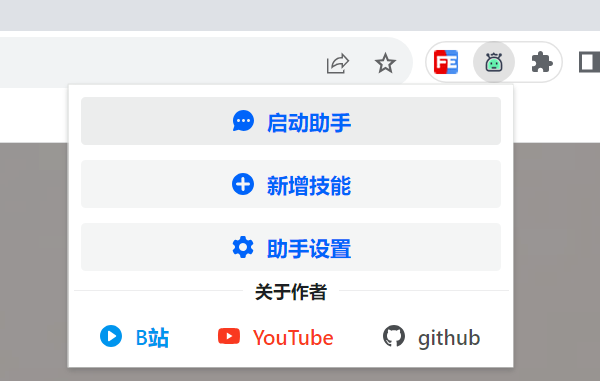
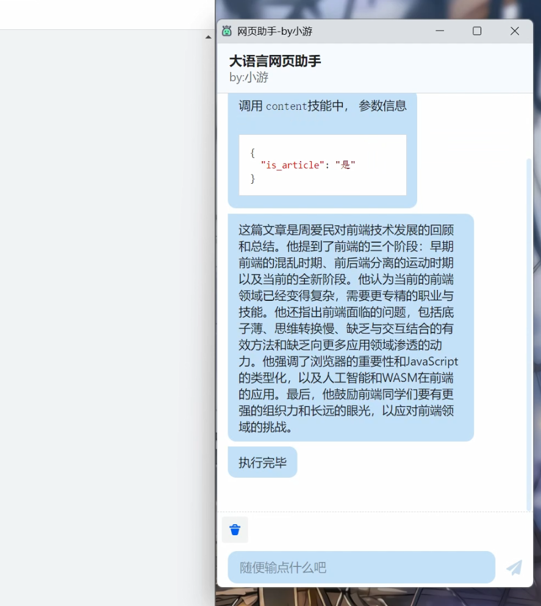
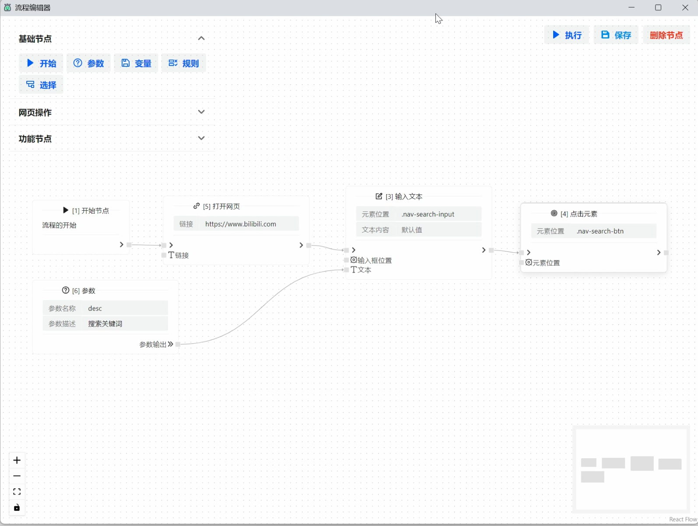

# 基于大语言模型的浏览器助手

## 功能特点

- 本应用为chrome扩展，可以直接集成到支持该扩展的浏览器
- 基于openapi gpt3模型，可以理解用户的输入并执行对应的操作
- 强大的流程编辑功能，让你不需要开发代码即可给助手添加一个新的技能

## 项目截图

支持文章总结，翻译，润色等功能

支持帮你完成一些操作

支持强大的技能编辑功能，所有的技能都可以使用流程编辑器来完成

